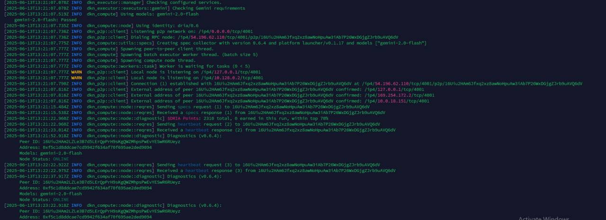

# 🚀 Dria Node One-Command Installation Guide

Welcome! This guide will help you set up your Dria Node in just a few steps. Follow along for a smooth installation and management experience.

---

## 🖥️ Step 1: Create a Screen Session (For VPS Users)

```bash
screen -S dria
```

---

## ⚡ Step 2: Install & Setup Dria Node

Run the following command:

```bash
bash <(curl -s https://raw.githubusercontent.com/HustleAirdrops/Dria-One-Command-Guide/main/installation.sh)
```

- **When prompted:** Enter your **private key** and **Gemini API key**.
- **Get Gemini API key:** [aistudio.google.com/app/apikey](https://aistudio.google.com/app/apikey)

> **Note:** Default model is **Gemini 2.0 Flash**.

---

## ✅ Installation Complete!

- **Detach screen (VPS):** Press `Ctrl+A+D`

---

## 🔄 Starting Your Node (Next Day)

- **For VPS:**  
    ```bash
    sudo dkn-compute-launcher start
    ```

- **For Windows:**  
    ```bash
    dkn-compute-launcher.exe start
    ```

---

## 📊 Node Logs Example

> 

*(Image size: 500px)*

---

## 🤖 Node Status & Updates

- **Check status & updates:** [@DriaChecker_bot](https://t.me/DriaChecker_bot)

---

## 🏅 Get Your Discord Role

- **Fill this form:** [Typeform Link](https://form.typeform.com/to/Eav42hR3?typeform-source=www.google.com)

---

## 🔄 How to Change Models

1. **Stop your node** (if running).
2. Run:
     ```bash
     dkn-compute-launcher settings
     ```
3. Go to **models** and select your preferred one.
4. **Start the node again.**

---

## 🗑️ Delete Your Node

```bash
sudo rm -rf .dria
```

---

## ❓ Q&A

**1. Node not running?**  
Try changing the model.

**2. Why aren't points updating?**  
Points are not updated instantly. Your node earns steps as it completes tasks, so there may be a delay (days or weeks). If your node is running fine, you'll get your points!

---

> 💬 **Need help?** [@Legend_Aashish](https://t.me/Legend_Aashish)  
> 📺 **Guides, videos & updates:** [@Hustle_Airdrops](https://t.me/Hustle_Airdrops)  
> 🚀 **Stay ahead — join the channel now!**

---

**Happy Node Running! 🚀**
